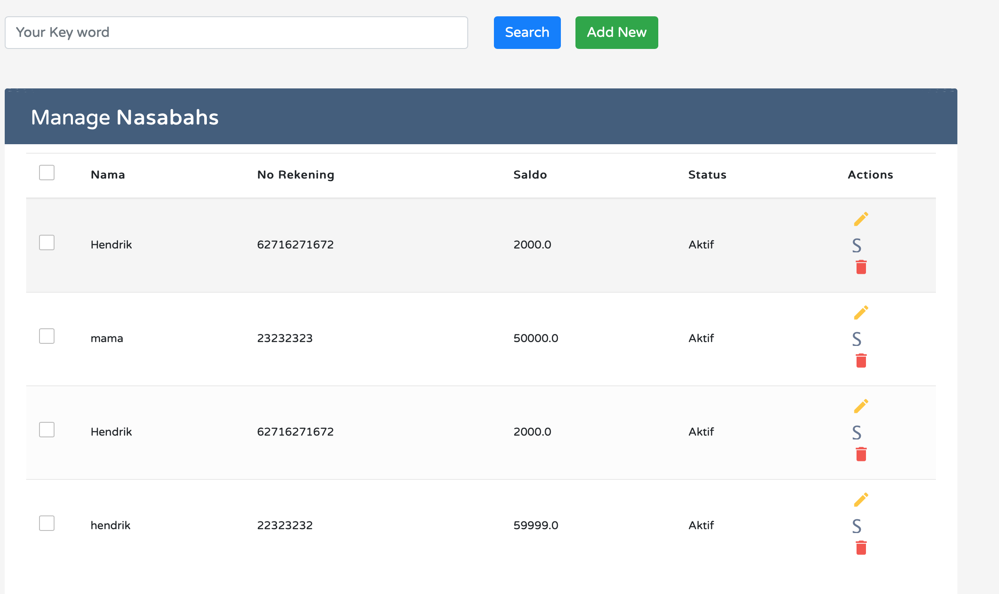

# test bca

Here is a run this project step by step.

<a href="https://www.youtube.com/channel/UC3gabTPMiE18TeVVLdO-Vyw/videos">
  
</a>

Steps

```
 clean spring-boot:run
```

http://localhost:9090/login


